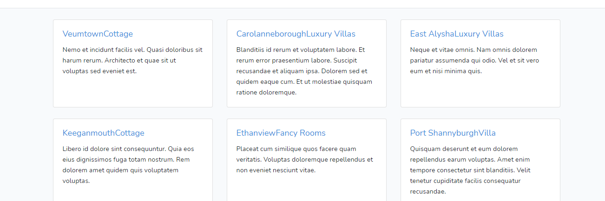
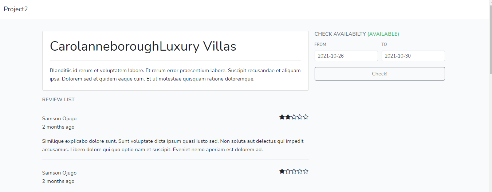

<h2>Booking API</h2>

A booking API with the frontend created with VueJs and Backend with Laravel. 

Users can see list of bookings, read information about each bookings with reviews and ratings. Users can also check availability of bookings.

<ul>
<li>Fetch all bookings  

<li>Fetch all bookables and check availability</li>

</ul>

Project idea was gotten from an <b>Udemy tutorial Fullstack development with VueJs and Laravel</b>

